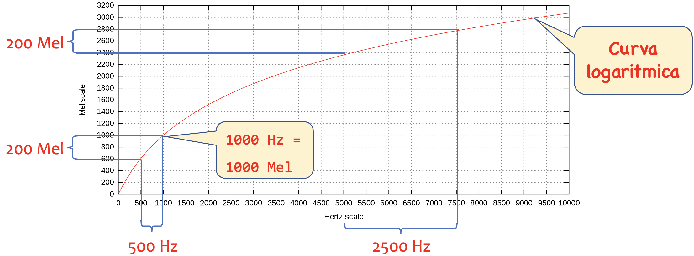
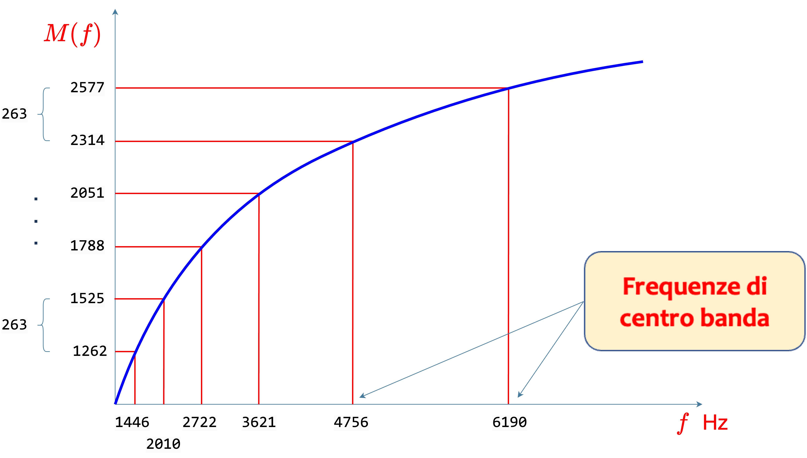
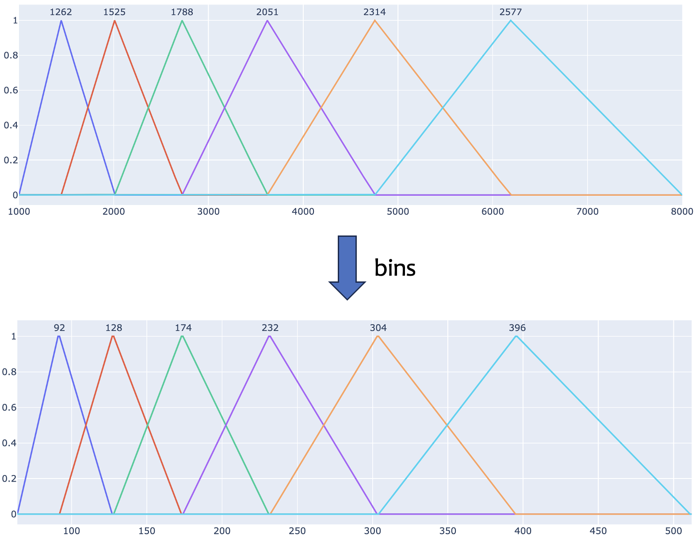
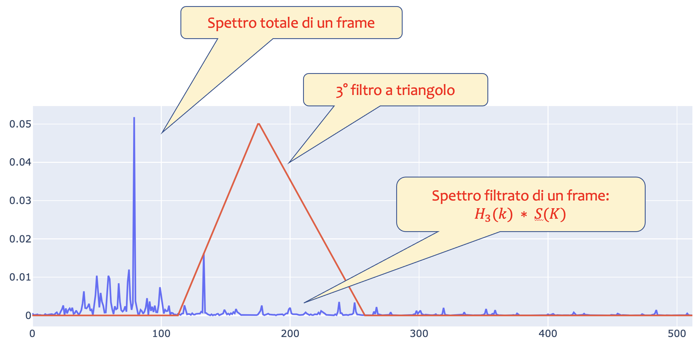
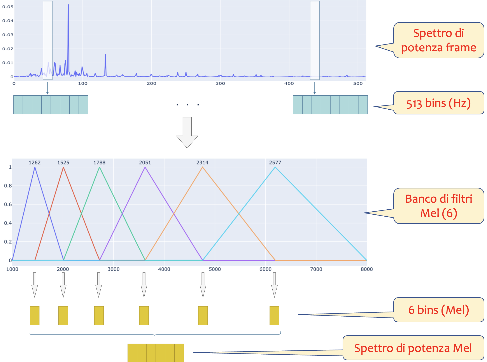
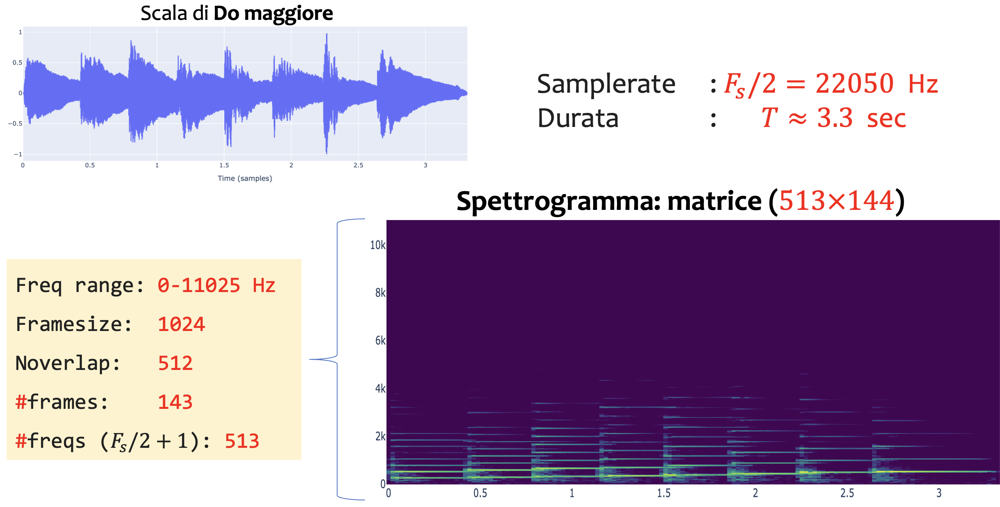
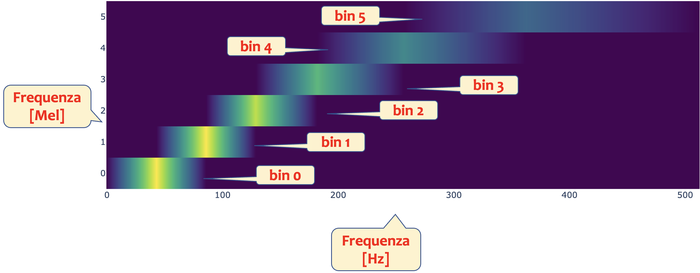
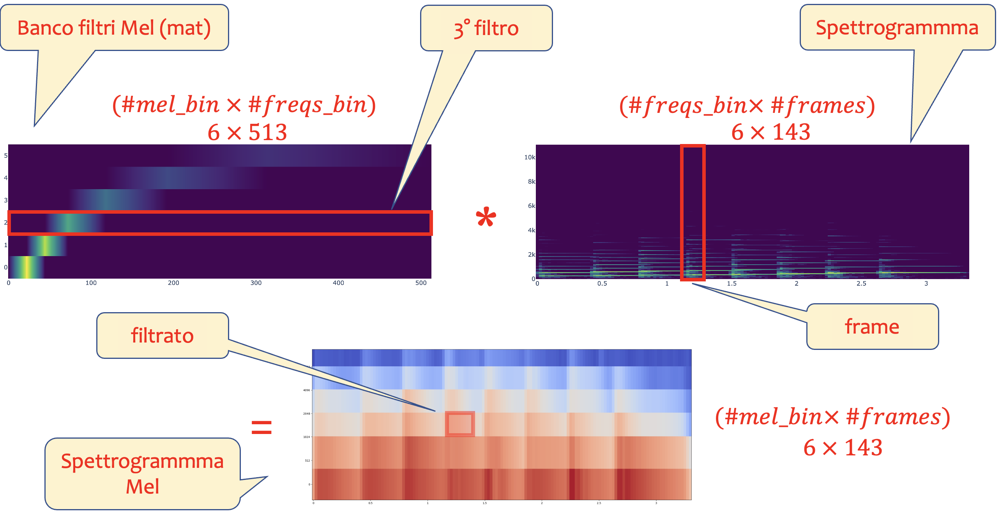
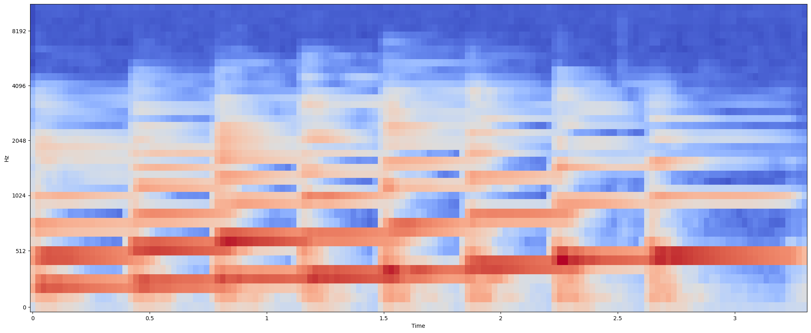
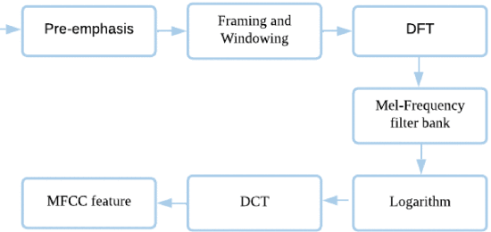

Feature audio
====

---

## Introduzione

L'estrazione di feature è un processo di elaborazione e trattamento delle informazioni latenti o nascoste nel segnale rappresentato da dati raw, catturati direttamente da un sensore. Lo scopo di estrazione di feature è quello di eliminare ridondanze e rumore, o addirittura componenti che renderebbero inefficaci la rappresentazione dell'informazione presente nei campioni del segnale, senza far perdere quella utile, come pattern complessi dati dalle emozioni, ad esempio. Inoltre, le feature estratte aiutano a sviluppare modelli di elaborazione o apprendimento più efficaci e veloci rispetto ai dati grezzi. Se ci soffermiamo sul caso del parlato, il punto principale da capire è che i suoni generati da un essere umano sono filtrati dalla forma del tratto vocale che comprende cavo orale, con lingua e denti, laringe, epiglottide, ecc. Questa forma determina il suono che viene emesso. Se riusciamo a determinare con precisione la forma, dovremmo avere una rappresentazione accurata del fonema prodotto. La forma del tratto vocale si manifesta nell'inviluppo dello spettro di potenza a breve termine e il compito delle feature che originano da questo paradigma è quello di rappresentare accuratamente questo inviluppo. 

Lo spettrogramma Mel è una feature importante nell'ambito audio ed è una variante dello spettrogramma comunemente utilizzata nell'elaborazione audio, nonché nell'apprendimento automatico. È simile a uno spettrogramma in quanto mostra il contenuto di frequenza di un segnale audio nel tempo, ma su un asse di frequenza diverso. In uno spettrogramma standard, l'asse della frequenza è lineare e viene misurato in hertz (Hz). Tuttavia, il sistema uditivo umano è più sensibile alle variazioni delle frequenze più basse rispetto a quelle più alte e questa sensibilità diminuisce logaritmicamente all'aumentare della frequenza. La scala Mel è una scala percettiva che approssima la risposta in frequenza non lineare dell'orecchio umano. Per esempio, nella tradizione della musica occidentale i suoni così chiamati consonanti vengono descritti come armoniosi, gradevoli e stabili, mentre i suoni dissonanti vengono descritti come spiacevoli e poco armoniosi. La consonanza e la dissonanza possono essere identificate visibilmente su uno spettrogramma Mel analizzando le distribuzioni delle frequenze. Gli intervalli consonanti mostrano strutture armoniche, chiare e stabili, mentre gli intervalli dissonanti mostrano schemi più irregolari e meno stabili che sembrano lasciare un’ombra. I modelli di intelligenza artificiale possono apprendere questi schemi visivi allenandosi su ampie serie di dati musicali, consentendo loro di riconoscere e replicare le relazioni armoniche che producono suoni piacevoli e composizioni esteticamente pi`u gradevoli.

Un altro esempio di feature divenuto oramai classico in ambito elaborazione del segnale audio, è rappresentato dallo spettrogramma e i coefficienti cepstrali in scala Mel, i cosiddetti mel-spectrogram e  Mel Frequency Cepstral Coefficients (MFCC). Quest'ultimi in particolare, rappresentano una tecnica per l'estrazione di feature da un segnale audio e, con maggiore efficacia, da segnali che catturano la voce umana. In sostanza, si fornisce una rappresentazione dello spettro di potenza a breve termine di un suono basata sulla trasformata coseno dello spettro di potenza logaritmico su una scala di frequenza non lineare, detta scala Mel.  Quest'ultima mira a replicare la risoluzione in frequenza tipica degli esseri umani, adeguando l'analisi a cogliere le differenza che sussistono nel percepire frequenze basse e frequenze alte nei suoni che arrivano all'udito. Gli MFCC sono una caratteristica ampiamente utilizzata nel riconoscimento automatico del parlato e dei parlanti. Sono stati introdotti da Davis e Mermelstein negli anni '80 e da allora sono sempre stati lo stato dell'arte. Prima dell'introduzione delle MFCC, veniva impiegata la predizione lineare o classificatori HMM (Hidden Markov Models). Di seguito si illustrano gli aspetti principali degli MFCC, i motivi per cui sono una feature audio affidabile e come implementarli.

---
## Lo spettrogramma in scala Mel

Un segnale audio varia costantemente, ma per semplificare l’analisi si assume che su scale temporali brevi il segnale non cambi in modo significativo (statisticamente, ossia stazionarietà statistica, anche se i campioni continuano a variare). Per questo motivo il segnale viene suddiviso in finestre temporali di 20-40 ms. Se la finestra è troppo corta, non si raccolgono abbastanza campioni per ottenere una stima spettrale affidabile; se è troppo lunga, il segnale cambia eccessivamente all’interno della finestra stessa.

Il passo successivo consiste nel calcolare lo spettro di potenza di ciascuna finestra. Questo è ispirato al funzionamento della coclea umana (un organo nell’orecchio) che vibra in punti diversi a seconda della frequenza dei suoni in ingresso. A seconda del punto della coclea che vibra (attivando accurati organi ciliati), si attivano diversi nervi che informano il cervello sulla presenza di determinate frequenze. La stima spettrale ottenuta con il periodogramma svolge un ruolo analogo, identificando le frequenze presenti nella finestra.

Tuttavia, la stima spettrale del periodogramma contiene ancora molte informazioni non necessarie per l'elaborazione del segnale audio. In particolare, la coclea non distingue tra frequenze molto vicine, e questa limitazione diventa più pronunciata con l’aumento delle frequenze. Per questo motivo, i valori dei bin del periodogramma vengono raggruppati e sommati per ottenere un’indicazione dell’energia presente in diverse regioni di frequenza. Questo processo è realizzato con il filtro Mel: il primo filtro è molto stretto e misura quanta energia si trova vicino a 0 Hertz. Man mano che le frequenze aumentano, i filtri diventano più ampi poiché le variazioni di dettaglio perdono importanza. Ci interessa solo una stima approssimativa dell’energia in ciascuna regione. La scala Mel specifica come distanziare i filtri e quanto renderli larghi.

Una volta calcolate le energie dei filtri Mel, si applica il logaritmo. Anche questa operazione è ispirata al funzionamento dell’udito umano: non percepiamo la sonorità in modo lineare. Per raddoppiare il volume percepito di un suono, è necessario fornire circa 8 volte più energia. Ciò significa che grandi variazioni di energia possono sembrare trascurabili se il suono è già molto forte. Questa operazione di compressione rende le feature estratte più simili alla percezione umana. Si utilizza il logaritmo anziché, ad esempio, la radice cubica perché il logaritmo consente di applicare la sottrazione della media cepstrale, una tecnica di normalizzazione del canale.

L’ultimo passaggio consiste nel calcolo della Trasformata Discreta del Coseno (DCT) delle energie logaritmiche dei filtri Mel. Questo è fatto per due motivi principali. Poiché i filtri Mel si sovrappongono, le energie dei filtri risultano altamente correlate. La DCT decorrela le energie, permettendo di utilizzare matrici di covarianza diagonali per modellare le feature. Tuttavia, vengono mantenuti solo 12 dei 26 coefficienti DCT, perché i coefficienti DCT più alti rappresentano variazioni rapide delle energie dei filtri che, in realtà, degradano le prestazioni. Eliminandoli, si ottiene un piccolo miglioramento delle prestazioni.

### Scala Mel

La scala Mel è una scala di percezione dell'altezza di un suono. È stata proposta da Stanley Smith Stevens, John Volkman e Edwin Newman nel 1937 nel Journal of the Acoustical Society of America. La scala Mel è una funzione definita a tratti che divide la banda di frequenza di un segnale in sottobande e quindi estrae i coefficienti cepstrali usando la trasformata coseno discreta (DCT) a valle di una trasformazione logaritmica delle frequenze del segnale stesso. L'idea centrale di questa trasformazione è che i suoni di uguale distanza sulla scala Mel sono percepiti come di uguale distanza dagli umani.

Gli studi hanno dimostrato che gli umani non percepiscono le frequenze su una scala lineare. Siamo più bravi a rilevare differenze nelle frequenze più basse rispetto alle frequenze più elevate. Ad esempio, possiamo facilmente dire la differenza tra 500 e 1000 Hz, ma difficilmente saremo in grado di dire una differenza tra 10.000 e 10.500 Hz, anche se la distanza tra le due coppie è la stessa. Quindi, anche se la distanza tra le due serie di suoni è la stessa, la nostra percezione della distanza non lo è. Questo è ciò che rende la scala Mel fondamentale nelle applicazioni di signal processing e machine learning per l'audio, poiché mira a riprodurre la nostra percezione del suono.

La trasformazione dalla scala Hertz alla scala Mel è la seguente:

$$\label{eq:mel}
m= M(f)=1125 \ln\left(1+𝑓/700\right)
$$

mentre la trasformazione inversa risulta:

$$
f=M^{-1}(m)=700\left( e^{m/1125}-1\right)
$$

dove $f$ è la frequenza espressa in Hz ed $m$ è la frequenza espressa in Mel, per l'appunto. Come mostrato in , la formula per la scala Mel è una trasformazione logaritmica della frequenza in Hz di un segnale, visualizzata di seguito

&nbsp;

&nbsp;

Dalla figura si nota innanzitutto la corrispondenza di 1000 Hz e 1000 Mel: la scala è spesso considerata approssimativamente lineare fino a 1 kHz e logaritmica in seguito. E' poi messo in evidenza quanto detto sopra circa la progressione lineare sulla scala Mel e quella esponenziale sulla scala in frequenza: uguali differenze di punti sulla scala Mel proiettano bande di ampiezza crescente nella scala delle frequenze.

### Banchi di filtri Mel

Innanzitutto costruiamo i punti di centro-banda di ogni filtro del banco, che determinano l'inizio e fine di ogni banda di frequenze coperto dal banco di filtri stesso. La frequenza minima scelta di norma è $f_{min}=1000$ (lasciando inalterati i primi 1000 Hz) e $f_{min}=F_s/2$, con $F_s$ la frequenza di campionamento del segnale. Per fare ciò, convertiamo prima i due estremi del range $f_{min}$ e $f_{max}$ nello spazio Mel, cioè $M(f_{min})$ e $M(f_{max})$. Successivamente costruiamo un insieme di punti equidistanziati tra le due frequenze Mel estreme $M(f_{min})$ e $M(f_{max})$. Questo processo è mostrato nell'immagine qui sotto in cui sono evidenziate i centro-banda in frequenza Hz proiettati da equa ripartizione delle scala mel in 6 bande distinte, con passo 263 Mel, $f_{min}=1000$ e $f_{max}=8000$, avendo fissato $F_s=16000$. Gli estremi Mel risultano dunque $M(f_{min})=1000$ e $M(f_{max})=2840$, con valori intermedi: 

$$
M(f)=[1000,\quad 1262,\quad 1525,\quad 1788,\quad 2051,\quad 2314,\quad 2577,\quad 2840].
$$

I corrispondenti centro-banda in Hz sono pertanto: 

$$
M^{-1}(f)=[1000,\quad 1446,\quad 2010,\quad 2722,\quad 3621,\quad 4756,\quad 6190,\quad 8000].
$$

&nbsp;

&nbsp;

Il banco di filtri Mel viene descritto come una sequenza di filtri triangolari (a forma isoscele) ognuno dei quali è costruito su 3 valori di frequenza contigui: della terna i due estremi rappresentano la base e quello centrale il vertice. Va aggiunto ogni coppia di triangoli, e quindi le bande corrispondenti, sono sovrapposti al 50%, come mostra la figura. Notare altresì che i valori riportati dell'asse orizzontale superiore e quello inferiore riportano le sequenze di frequenze Mel e Hz, rispettivamente ed elencate sopra. 

&nbsp;

&nbsp;

Un passo importante da sottolineare è che dopo la conversione delle frequenze Mel nello spazio di frequenza in Hz occorre normalizzare i valori di frequenza alla dimensione (risoluzione in frequenza) usata nel calcolo della FFT, cioè numero $N$ di campioni usati nel calcolo dello spettrogramma per ogni frame temporale (e pari alla dimensione delle finestre applicate al segnale), come mostrato nel Capitolo 3. Nella figura sopra si mostra questo aspetto evidenziando $N/2+1=513$ bin che derivano dall'aver usato una finestra di $N=1024$ campioni per il calcolo dello spettro di potenza di un frame dei quali, per la simmetria della FFT, la metà copre l'intervallo in frequenza $[0 - F_s/2]$. 

 La funzione di trasferimento $H_m(k)$ del filtro triangolare $m$-esimo è definita come segue:

$$
\begin{align*} H_m(k)=\begin{cases} \displaystyle 0 ,& k < f\left ({m-1 }\right)\\ \displaystyle \frac {k-f\left ({m-1 }\right)}{f\left ({m }\right)-f\left ({m-1 }\right)}, & f\left ({m-1 }\right)\le k < f\left ({m }\right)\\ \displaystyle 1 & k=f\left ({m }\right)\\ \displaystyle \frac {f\left ({m+1 }\right)-k}{f\left ({m+1 }\right)-f(m)}, & f\left ({m }\right) < k\le f\left ({m+1 }\right)\\ \displaystyle 0 & k>f(m+1) 
\end{cases}
\end{align*}
$$

con il vincolo di normalizzazione per cui il valore di $H_m(f(m))=1$ per la frequenza centrale $f(m)$ del filtro triangolare. 

L'azione di ogni singolo filtro del banco è quella di catturare l'energia data dallo spettro di potenza $S(k)$ di un frame del segnale che insiste nella banda di frequenze corrispondente. La figura sotto mostra - a titolo di esempio - il terzo filtro del banco in azione: si vede che il prodotto del filtro con lo spettro, cioè $H_3(k)S(k)$, svolge proprio il ruolo inteso, ossia quello di preservare l'energia in banda e tagliare quella complementare.

&nbsp;

&nbsp;

### Lo spettrogramma Mel

Uno spettrogramma Mel è uno spettrogramma in cui le frequenze vengono convertite nella scala Mel. Qui di seguito è mostrato l'uso del banco di filtri che trasforma lo spettro di potenza (spettrogramma) usuale nello spettro di potenza su scala Mel (spettrogramma Mel). L'output per ogni slot dello spettro di potenza su scala Mel rappresenta l'energia del segnale ristretto alla banda di frequenza che ogni filtro copre. Questa mappatura viene anche detta Mel binning. Il processo è mostrato in figura sotto. Naturalmente il numero di bin nelle due scale può essere diverso e in generale quello in scala Mel è molto minore (dell'ordine di qualche decina, ma può variare a seconda delle applicazioni), mentre nella scala in Hz si hanno risoluzioni tipicamente associate alla taglia della FFT impiegata (anche dell'ordine di qualche migliaia e qui in particolare 1024). 

&nbsp;

&nbsp;

Vediamo un esempio di applicazione del banco di filtri Mel allo spettrogramma di un segnale audio come la scala di Do maggiore nella figura sotto, campionato con $F_s=22050$.  Utilizzando una lunghezza della finestra di $N = 1024$ e un hop size di $H = N/2=512$, questo risulta in una risoluzione in frequenza (bin) di $F_s/N \approx 21.53 \, \text{Hz}$ e una risoluzione temporale di $H/F_s\approx 23.21 \, \text{ms}$, per un totale di 143 frame temporali. In definitiva, lo spettrogramma è una matrice di dimensioni $(\#\text{bin\_freqs}, \#\text{frames})$, cioè avente $\#\text{bin\_freqs}$ righe e $\#\text{frames}$ colonne.

&nbsp;

&nbsp;

Poiché lo spettrogramma è in forma matriciale, per ottenere lo spettrogramma Mel occorre passare in forma matriciale anche il banco di filtri triangolari Mel. Quelle che segue è un esempio di filtro con 6 bin in scala Mel, cioè $\#\text{bin\_mels}=6$, e 513 bin, cioè $\#\text{bin\_freqs}=513$, in scala di Hz e mostrato tramite un'immagine, i cui pixel hanno valori coerenti con quelli degli spettrogrammi. 

&nbsp;

&nbsp;

Infine si ottiene lo spettrogramma Mel attraverso la moltiplicazione della matrice del filtro $M$ con lo spettrogramma $S$, con dimensioni rispettivamente:

$$
M\in\mathbb{R}^{(\#\text{bin\_mels})\times(\#\text{bin\_freqs})}\qquad\quad
S\in\mathbb{R}^{(\#\text{bin\_freqs})\times(\#\text{frames})}
$$

che nel caso qui descritto diventano:

$$
M\in\mathbb{R}^{6\times 513} \qquad\quad S\in\mathbb{R}^{513\times 143}
$$

da cui si ottiene lo spettrogramma Mel 

$$
\text{Mel spectrogram} = M\,S\in \mathbb{R}^{6\times 143}
$$

e mostrato in figura 

&nbsp;

&nbsp;

L'intero processo è sintetizzato nella seguente immagine.

&nbsp;

&nbsp;

Se si aumenta il numero di bin nella scala Mel si ottiene maggior risoluzione proprio in quella scala di frequenze, come il caso sottostante in cui si considerano 120 bin Mel e si mostrano in sequenza il filtro e lo spettrogramma Mel, rispettivamente.

&nbsp;

&nbsp;

&nbsp;

&nbsp;

---
## Mel Frequency Cepstral Coefficient (MFCC)

### Il processo di estrazione di MFCC
MFCC è una delle feature più comunemente usate in una varietà di applicazioni, in particolare nell'elaborazione del segnale vocale come l'analisi del segnale audio, il riconoscimento vocale e l'identificazione di genere. MFCC possono essere calcolati conducendo cinque passi consecutivi, vale a dire preprocessing e miglioramento del segnale, il calcolo dello spettro di potenza, applicazione di un banco filtri MEL agli spettri di potenza ottenuti, calcolo del logaritmo dello spetto filtrato e infine applicando il DCT .La seguente figura illustra i processi del calcolo MFCC.

#### A. Pre-emphasis (preprocessing)
 
La pre-enfasi si riferisce al filtro che enfatizza le frequenze più elevate. Il suo scopo è bilanciare lo spettro dei suoni espressi che hanno un ripido decadimento nella regione ad alta frequenza (a volte viene soppressa durante processi di elaborazione o cattura del segnale). Per esempio, un segnale vocale se registrato con un microfono ad una certa distanza arriva a perdere +6dB/ottava rispetto al vero spettro del tratto vocale. Pertanto, la pre-enfasi rimuove alcuni degli effetti glottali dai parametri del tratto vocale. Il filtro pre-enfasi più comunemente usato è dato dalla seguente funzione di trasferimento

$$
H(z) = 1 − bz^{−1} 
$$

che rappresenta un filtro passa-alto a cui vengono spesso associati i coefficienti $[1, -0.97]$.

#### B. Framing (windowing) del segnale
L'idea alla base della partizione in "frame" del segnale raw è quella di avere segmenti brevi in cui il segnale tende ad essere più stazionario al fine di avere proprietà acustiche stabili. Per quanto riguarda il segnale vocale, il periodo di 20-30 ms è riferito come segmento quasi stazionario (QSS) dal momento che il tempo tra due eventi glottali è di circa 20 ms. In aggiunta, la sovrapposizione di frame di 10 ms consentono di catturare meglio le feature temporali del segnale vocale. In generale, le finestre di Hanning e Hamming sono tra le più usate. Queste finestre possono migliorare le armoniche, e la riduzione dell'effetto di bordo durante il calcolo della DFT sul segnale. La figura seguente illustra le finestre rettangolari di Hamming e Hanning in entrambi i domini temporali e di frequenza.

#### C. Spettro di potenza
Lo spettro di potenza può essere descritto come la distribuzione della potenza dei componenti alle varie frequenze di cui è composto il segnale.Tradizionalmente, la trasformata discreta di Fourier (DFT) viene utilizzata per calcolare lo spettro di potenza. Lo spettro di potenza di ciascun frame $x(n)$ è ottenuto elevando al quadrato il valore assoluto della risposta in frequenza della DFT, cioè:

$$
|X(k)|^2=\left|\sum \limits _{n=0}^{N-1} {x\left ({n }\right)} e^{-j\frac{2\pi}{N}nk}\right|^2 \quad k=1,2,3\ldots N-1\tag{1}
$$

#### E. Discrete Cosine Transform (DCT)

La DCT esprime una sequenza finita di punti dati dalla somma di funzioni coseno oscillanti a frequenze diverse, multiple di una frequenza base. Nel processo MFCC, la DCT viene applicata a valle del banco di filtri Mel per selezionare la maggior parte dei coefficienti utili a catturare l'informazione massima nelle log ampiezze spettrali dei blocchi filtrati. La DCT è calcolata dall'equazione seguente:

$$
X(k)=\sum_{n=0}^{N-1} x_{n} \cos\left({2\pi jnk}/ N\right),\quad k=1,2,3\ldots N-1
$$
